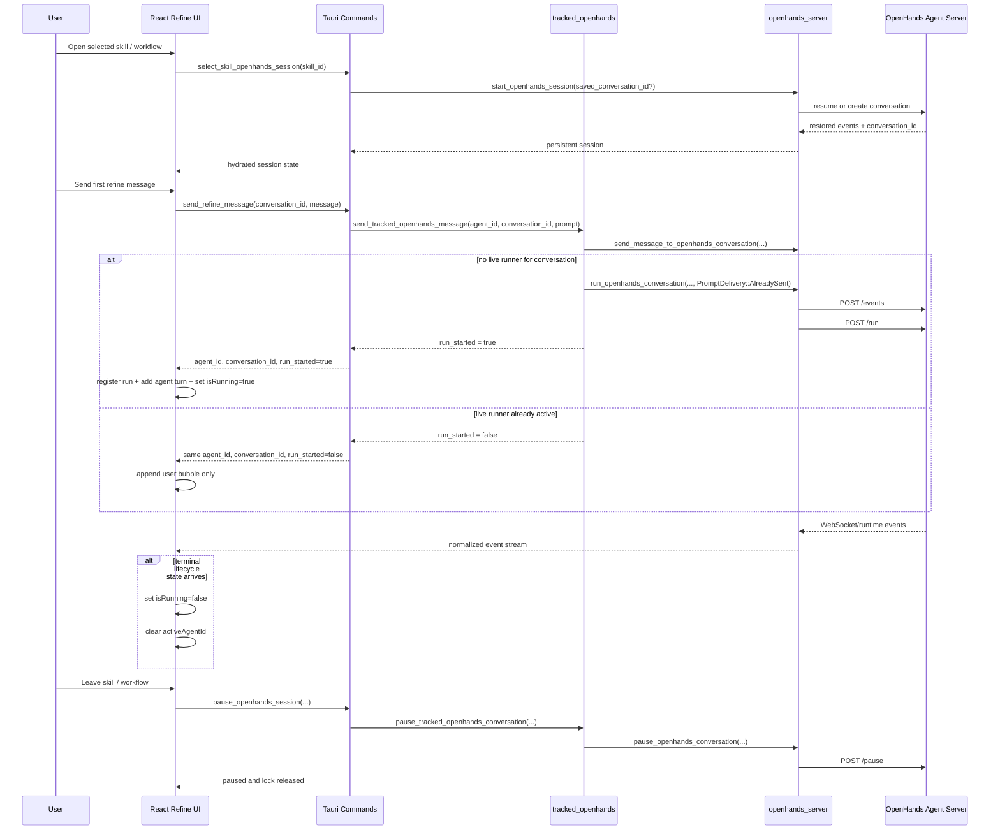

# Refine Sequence

This page describes the runtime sequence for Refine after the OpenHands
runtime-contract refactor.

## Main Flow

## Key Rules

- Refine uses one persistent selected-skill conversation.
- The first user message for an idle conversation is `send` then `run`.
- A follow-up message during an active run is `send` only.
- Follow-up sends reuse the existing `agent_id`; they do not create a second
  local run.
- Leaving the selected skill pauses the conversation; it does not delete it.
