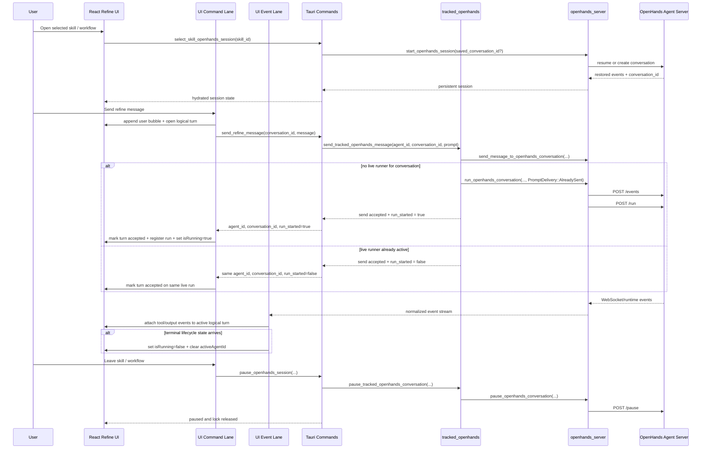

# Refine Sequence

This page describes the runtime sequence for Refine after the OpenHands
runtime-contract refactor.

## Main Flow

## Key Rules

- Refine uses one persistent selected-skill conversation.
- The first user message for an idle conversation is `send` then `run`.
- A follow-up message during an active run is `send` only.
- Follow-up sends reuse the existing `agent_id`; they do not create a second local run.
- Refine still creates a new logical turn for every user send, even when the same OpenHands run stays active. Later tool calls and outputs are rendered under that turn until the next user send starts the next turn boundary.
- The UI command lane owns turn creation and send acceptance state; the UI event lane owns inbound runtime events and attaches them to the current turn.
- The live event stream must not be the only source of truth for whether a user turn exists. A send that is locally accepted by the backend still belongs to a turn even if the next tool or agent event arrives later.
- Leaving the selected skill pauses the conversation; it does not delete it.
