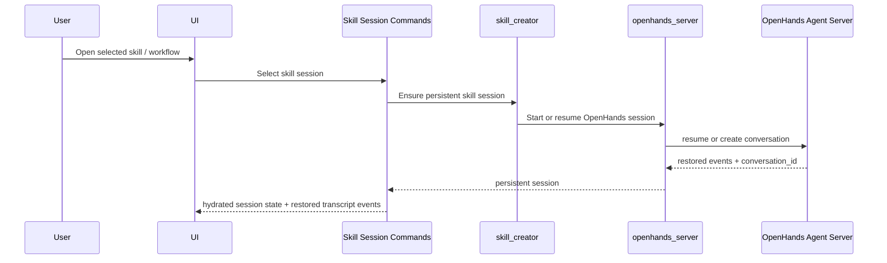
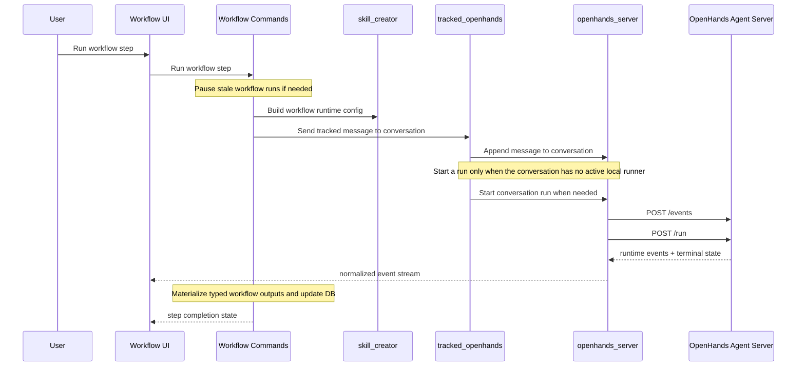
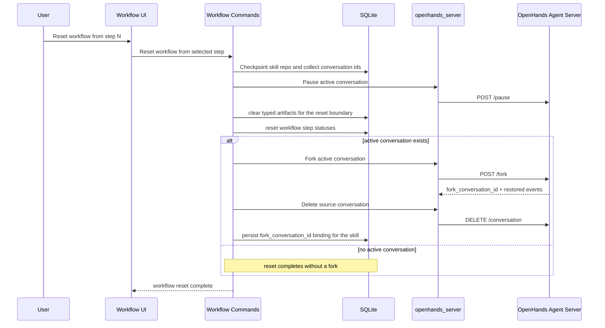

# Selected-Skill Conversation Sequence

This page describes the shared persistent selected-skill conversation flow and the workflow-specific extensions that run on top of it.

## Session Bootstrap Flow

## Workflow Step Run Flow

## Workflow Reset Flow

## Key Rules

- Selected-skill persistent sessions use one canonical `conversation_id`.
- Session bootstrap is shared across workspace and workflow surfaces.
- Workflow steps send into the existing conversation and only start a run when no live runner exists.
- The selected-skill conversation remains the transcript key while workflow-specific state lives separately in `session-runtime-store` and workflow DB rows.
- Workflow reset is product-command-owned: pause active conversations, clear typed artifacts and statuses, fork when a live conversation exists, delete the source conversation after a successful fork, and then rebind the skill to the forked conversation ID.
- Transcript rendering reads from the canonical `conversation-store` timeline keyed by `conversationId`; workflow-specific completion, gate, and artifact UI is layered around that shared conversation stream.
