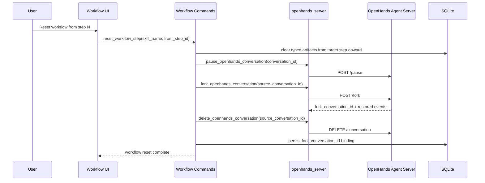

# Workflow Sequence

This page describes how Workflow uses the shared OpenHands runtime contract.

## Step Run Flow

```mermaid
sequenceDiagram
    participant U as User
    participant FE as Workflow UI
    participant CMD as Workflow Commands
    participant L2 as skill_creator
    participant L3 as tracked_openhands
    participant L1 as openhands_server
    participant OHS as OpenHands Agent Server

    U->>FE: Open workflow for selected skill
    FE->>CMD: select_skill_openhands_session(skill_id)
    CMD->>L2: ensure_skill_session(...)
    L2->>L1: start_openhands_session(saved_conversation_id?)
    L1->>OHS: resume or create conversation
    OHS-->>L1: restored events + conversation_id
    L1-->>CMD: session ready
    CMD-->>FE: hydrated workflow session state

    U->>FE: Run workflow step
    FE->>CMD: run_workflow_step(skill_id, skill_name, step_id)
    CMD->>L2: build_skill_creator_config(intent=WorkflowStep)
    CMD->>L3: send_tracked_openhands_message(conversation_id, prompt)
    L3->>L1: send_message_to_openhands_conversation(...)
    alt no live runner for conversation
        L3->>L1: run_openhands_conversation(..., PromptDelivery::AlreadySent)
        L1->>OHS: POST /events
        L1->>OHS: POST /run
    else live runner already active
        Note over L3,L1: append message only; do not start a second runner
    end
    OHS-->>L1: runtime events + terminal state
    L1-->>FE: normalized event stream
    CMD->>CMD: materialize typed workflow outputs / update DB
    CMD-->>FE: step completion state
```

## Reset Flow



## Key Rules

- Workflow uses the same persistent selected-skill conversation model as the workspace conversation surface.
- Workflow steps send into the existing conversation and only start a run when no live runner exists.
- Reset ownership stays at the product-command layer: pause, clear typed artifacts, fork, delete source, then rebind the saved conversation ID.
- Transcript rendering reads from the canonical `conversation-store` timeline keyed by the selected session `conversationId`, and workflow runtime state uses the session-centric `session-runtime-store` lifecycle surface rather than any legacy transcript seam.
