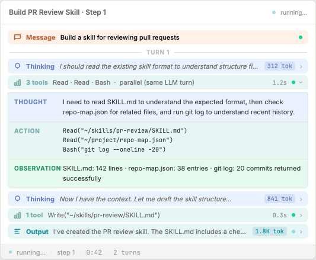
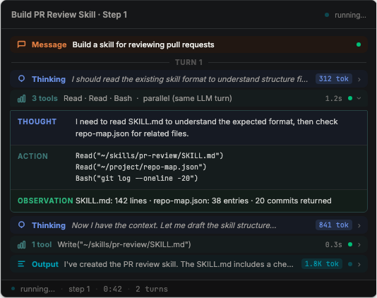

# Event Display Redesign

## Goal

Replace the current workflow event display (chat bubbles + slide-out drawer) with a compact activity-log style: every event is a collapsible tinted row, and tool-call rows expand inline to show the agent's Thought → Action → Observation.

## Design

### Visual

**Light mode**



**Dark mode**



### Row anatomy

Each row is a single horizontal strip:

```text
[tinted bg] [icon] [LABEL] [summary text ···] [tok] [dur] [●] [›]
```

- **Tinted background** — faint `--chat-*-bg` tint, no border, colour encodes event type at a glance
- **Label** — bold 11px type name, coloured `--chat-*-border` to match the tint
- **Summary** — truncated 11px description, muted, italic for Thinking rows
- **tok** — token count badge (tinted, monospace), only on Thinking and Output rows
- **dur** — elapsed time (monospace, muted), only on tool-group rows
- **●** — 6px status dot: seafoam = done, pacific pulsing = running
- **›** — chevron, rotates 90° when open; absent on non-expandable rows

### Event-type → row colour mapping

| DisplayNode kind | Label | Background token | Label/dot token |
|---|---|---|---|
| `task_sent` | Message | `--chat-question-bg` | `--chat-question-border` |
| `reasoning` | Thinking | `--chat-thinking-bg` | `--chat-thinking-border` |
| `activity_trace`, `tool_batch`, `file_activity`, `terminal_activity` | N tools / 1 tool | `--chat-tool-bg` | `--chat-tool-border` |
| `agent_update` | Output | `--chat-subagent-bg` | `--chat-subagent-border` |
| `error`, `tool_error`, `subagent_error` | Error | `--chat-error-bg` | `--chat-error-border` |
| `lifecycle`, `pause`, `runtime_setup`, other | System | `--muted` | `--muted-foreground` |

### T/A/O inline expansion

Clicking a tool-type row expands a panel directly beneath it, with three colour-banded sections:

```text
┌─ tool row (teal tint) ──────────────────────────────── ▼ ─┐
├─ THOUGHT  (--chat-thinking-bg) ──────────────────────────┤
│  Agent's reasoning text (from DisplayNode.thoughtText /   │
│  reasoningText, or first member's thoughtText)            │
├─ ACTION   (--chat-tool-bg) ──────────────────────────────┤
│  Tool name + monospace inputs, one per parallel call      │
│  (from DisplayNode.members[] or actionText)               │
├─ OBSERVATION (--chat-result-bg) ─────────────────────────┤
│  Tool result text (from DisplayNode.observationText or    │
│  concatenated member observationTexts)                    │
└───────────────────────────────────────────────────────────┘
```

If `thoughtText`/`reasoningText` is empty, the Thought section is omitted. If `observationText` is empty, the Observation section is omitted.

### Parallel tool call grouping

The existing projection layer already groups parallel tool calls (same `llm_response_id`) into a single `DisplayNode` with `members[]`. The row label reads "N tools" and the summary lists tool names joined by " · ". The T/A/O expansion iterates `members[]` to list each tool's action and observation.

### Turn dividers

A thin labelled divider ("TURN N") is inserted between consecutive interaction cycles. A new turn starts whenever a `task_sent` node follows an `agent_update` node. Turn numbering is 1-based and resets per conversation.

### Status footer

`RunStatusFooter` (already exists) is unchanged — it receives `status`, `label`, `model`, `elapsedMs`, `turns`, and `cost` props derived from the event stream in `ConversationTimeline`.

## Architecture

### Retained (no changes)

- `useConversationEvents(conversationId)` — event subscription hook
- `projectConversationEvents(events)` → `DisplayNode[]` — full projection and grouping logic
- `RunStatusFooter` — footer display component
- `app/src/lib/conversation-display-semantics.ts` — projection implementation
- `app/src/lib/display-types.ts` — `DisplayNode` type definitions

### New components — `app/src/components/event-display/`

| File | Responsibility |
|---|---|
| `event-display-row.tsx` | Base collapsible row: tinted bg, label, summary, tok, dur, dot, chevron, lazy-mount content |
| `tao-section.tsx` | T/A/O inline panel: three colour-banded sections |
| `tool-group-row.tsx` | Tool-type rows; computes label ("N tools"), summary, wires T/A/O |
| `event-display-list.tsx` | Renders `DisplayNode[]` with turn dividers; dispatches to row or tool-group variant |
| `event-display-timeline.tsx` | Top-level: wires `useConversationEvents` → `projectConversationEvents` → list + footer |

### Deleted after integration

- `app/src/components/conversation/conversation-timeline.tsx`
- `app/src/components/conversation/conversation-event-row.tsx`
- `app/src/components/conversation/conversation-activity-group.tsx`
- `app/src/components/conversation/conversation-semantic-row.tsx`
- `app/src/components/agent-items/conversation-event-list.tsx` (unused EventShell-style list)
- `app/src/lib/conversation-event-projection.ts` (thin wrapper, inline into timeline)

## Implementation Plan

### Phase 1 — Base row component

**File:** `app/src/components/event-display/event-display-row.tsx`

Create a generic collapsible row component:

```ts
interface EventDisplayRowProps {
  bg: string;          // CSS var, e.g. "var(--chat-tool-bg)"
  labelColor: string;  // CSS var
  label: string;
  summary: string;
  italic?: boolean;
  tokenCount?: number;
  durationMs?: number;
  status?: "running" | "done" | "error";
  children?: ReactNode; // expansion content; absence = not expandable
  defaultExpanded?: boolean;
}
```

- Row hover: `filter: brightness(.96)`
- Expand/collapse via `useState`; content is lazy-mounted (ref gate, same pattern as `BaseItem` in backup branch)
- Token count badge: tinted with `color-mix(in oklch, bg, border 15%)`
- Duration: monospace, muted, only when > 0
- Status dot: seafoam (done), pacific + animate-pulse (running), destructive (error)
- Chevron: `›` rotates 90° when open

---

### Phase 2 — T/A/O section

**File:** `app/src/components/event-display/tao-section.tsx`

```ts
interface TaoSectionProps {
  thought?: string;
  action?: string;      // pre-formatted: tool name + inputs
  observation?: string;
}
```

- Three rows, each with an uppercase label (THOUGHT / ACTION / OBSERVATION) at 72px fixed width
- Section backgrounds: `--chat-thinking-bg` / `--chat-tool-bg` / `--chat-result-bg`
- Label colours: matching `--chat-*-border`
- Action content renders as `<code>` block in monospace
- Omit any section whose value is empty/undefined

---

### Phase 3 — Tool group row

**File:** `app/src/components/event-display/tool-group-row.tsx`

Handles all tool-type `DisplayNode` kinds (`activity_trace`, `tool_batch`, `file_activity`, `terminal_activity`).

Computes from `DisplayNode`:

- **label**: `"${members.length} tools"` if `members.length > 1`, else `"1 tool"`
- **summary**: tool names joined by ` · ` (from `members[].toolName` or `actionText`)
- **thought**: `node.thoughtText ?? node.reasoningText ?? members[0]?.thoughtText`
- **action**: format each member as `ToolName(input)` on its own line
- **observation**: `node.observationText` or concatenated member `observationText`s
- **durationMs**: derive from `members[]` source event timestamps if available

Renders `EventDisplayRow` with a `TaoSection` as children.

---

### Phase 4 — List with turn dividers

**File:** `app/src/components/event-display/event-display-list.tsx`

```ts
interface EventDisplayListProps {
  nodes: DisplayNode[];
}
```

- Walk `nodes`; insert a `<TurnDivider n={turnN} />` whenever a `task_sent` node follows an `agent_update` node
- Turn divider: thin `--border` line with centred "TURN N" label (10px, uppercase, muted, 45% opacity)
- Dispatch per node kind:
  - `task_sent` → `EventDisplayRow` (amber, no expand)
  - `reasoning` → `EventDisplayRow` (violet, italic summary, expandable to full reasoning text)
  - tool-type kinds → `ToolGroupRow`
  - `agent_update` → `EventDisplayRow` (pacific, expandable to full markdown output via `MemoizedMarkdown`)
  - `error`/`tool_error`/`subagent_error` → `EventDisplayRow` (destructive tint, expandable)
  - other → small muted system row (non-expandable)
- Window: render last 100 nodes max; show "N older events hidden" indicator above (same pattern as `ConversationEventList`)
- Each row animates in with `animate-message-in`

---

### Phase 5 — Top-level timeline

**File:** `app/src/components/event-display/event-display-timeline.tsx`

Direct replacement for `ConversationTimeline`. Same props: `{ conversationId: string }`.

```ts
export function EventDisplayTimeline({ conversationId }: { conversationId: string }) {
  const events = useConversationEvents(conversationId);
  const nodes = useMemo(() => projectConversationEvents(events), [events]);
  const footerState = useMemo(() => deriveConversationFooterState(events), [events]);
  // ... render Card + ScrollArea + EventDisplayList + RunStatusFooter
}
```

Copy `deriveConversationFooterState` from `conversation-timeline.tsx` into this file.

---

### Phase 6 — Integration

Update two files to swap the import:

1. `app/src/pages/workflow.tsx` — replace `ConversationTimeline` with `EventDisplayTimeline`
2. `app/src/components/workspace/workspace-conversation.tsx` — same swap

---

### Phase 7 — Delete old components

Remove after confirming integration works:

```text
app/src/components/conversation/conversation-timeline.tsx
app/src/components/conversation/conversation-event-row.tsx
app/src/components/conversation/conversation-activity-group.tsx
app/src/components/conversation/conversation-semantic-row.tsx
app/src/components/agent-items/conversation-event-list.tsx
app/src/lib/conversation-event-projection.ts
```

Update `app/src/__tests__/components/conversation/conversation-event-row.test.tsx` — replace with tests for `EventDisplayList` covering: message row renders, tool-group row renders, T/A/O section shows/hides on expand, turn divider insertion, window truncation indicator.

---

### Validation

Per `TEST_MAP.md`:

- Run `cd app && npm run test:unit` after any change to `app/src/`
- Run `cd app && npx tsc --noEmit` before committing
- E2E: tag `workflow` covers the workflow page; run affected Playwright suite after integration step
